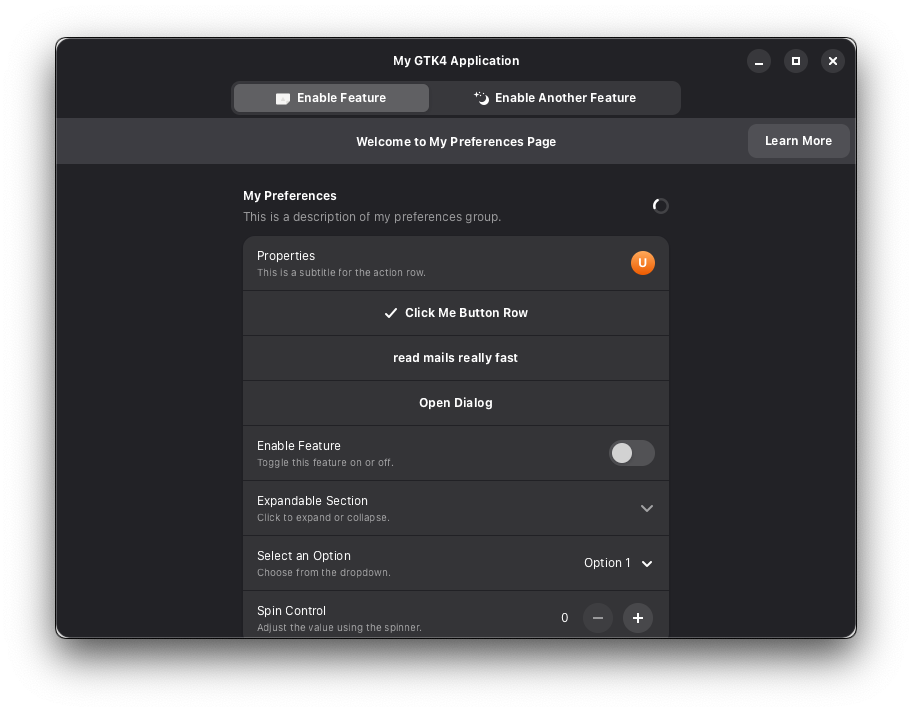

# Adwaita (GTK4) for Deno

> **Note** This library provides [Deno](https://deno.com/) bindings to
> [libadwaita](https://gnome.pages.gitlab.gnome.org/libadwaita/) and
> [GTK4](https://www.gtk.org/docs/) using Deno's
> [Foreign Function Interface (FFI)](https://docs.deno.com/runtime/fundamentals/ffi/).
> It enables building native GNOME-style UIs in TypeScript.

## About

- Uses FFI to call native libraries from TypeScript, allowing most UI work to be
  handled by libadwaita/GTK4.
- Business logic and application code remain in TypeScript, while rendering and
  system integration are managed natively.
- Suitable for developers who want to create desktop applications with a GNOME
  look and feel, without writing C or Rust.

### References

- [Deno FFI Documentation](https://docs.deno.com/runtime/fundamentals/ffi/)
- [libadwaita Documentation](https://gnome.pages.gitlab.gnome.org/libadwaita/doc/main/)
- [GTK4 Documentation](https://www.gtk.org/docs/)
- [GNOME Project](https://www.gnome.org/)
